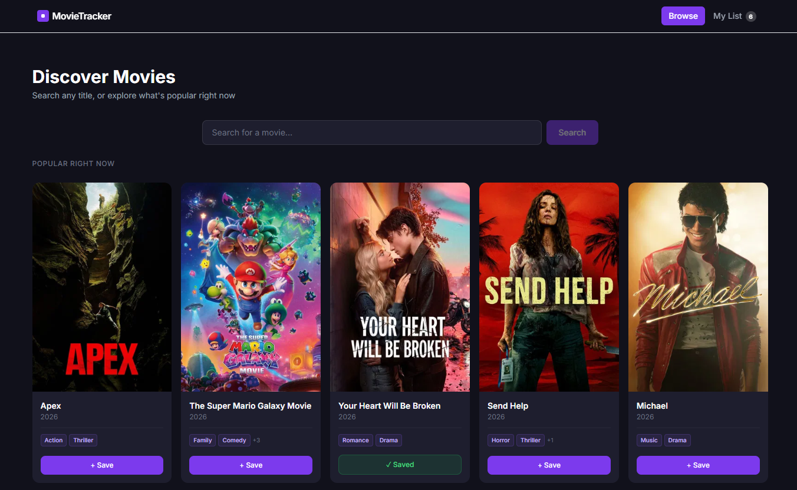

# Movie Tracker

A web app for browsing movies, saving favourites, tracking what you've watched, and leaving personal ratings and reviews.

**Live demo:** https://movie-tracker-nu-woad.vercel.app/



---

## Technologies Used

- **React 18** — component-based UI
- **Vite** — development server and build tool
- **Tailwind CSS** — utility-first styling
- **React Router v6** — client-side routing between Browse and My List pages
- **TMDB API** — movie data, posters, genres, and search
- **localStorage** — client-side persistence for saved movies, ratings, and reviews

---

## Setup Instructions

### 1. Clone the repo
```bash
git clone https://github.com/hevanx/movie-tracker.git
cd movie-tracker
```

### 2. Install dependencies
```bash
npm install
```

### 3. Add your TMDB API key
Create a `.env` file in the project root:
```
VITE_TMDB_KEY=your_api_key_here
```
Get a free API key at [themoviedb.org](https://www.themoviedb.org/settings/api). If no key is provided the app falls back to a set of sample movies so it still runs without one.

### 4. Start the dev server
```bash
npm run dev
```
Open [http://localhost:5173](http://localhost:5173) in your browser.

### 5. Build for production
```bash
npm run build
```

---

## Features

- Browse popular movies and search by title via the TMDB API
- Save movies to a personal list stored in localStorage
- Mark movies as watched or unwatched
- Rate movies 1–5 stars and write a personal review
- Filter saved movies by genre or watch status
- Fully responsive — works on mobile and desktop

---

## Architecture Overview

This is a fully client-side React app with no backend. All data persistence is handled through the browser's localStorage API.

```
src/
├── components/
│   ├── Navbar.jsx        sticky nav with active links and saved count badge
│   ├── SearchBar.jsx     controlled search form
│   ├── MovieCard.jsx     dual-mode card (Browse / My List)
│   ├── MovieGrid.jsx     responsive grid wrapper
│   ├── FilterBar.jsx     horizontally scrollable filter chips
│   ├── StarRating.jsx    interactive and readonly star rating
│   └── ReviewModal.jsx   edit UI with draft state and delete confirmation
├── pages/
│   ├── Browse.jsx        popular movies + search
│   └── MyList.jsx        saved movies + filters + stats
├── hooks/
│   └── useLocalStorage.js  custom hook that keeps React state and localStorage in sync
└── utils/
    ├── tmdb.js           all TMDB API calls with genre caching
    └── sampleData.js     fallback movies for when no API key is set
```

**State management:** All saved movie state lives in `App.jsx` and flows down as props. No external state library — `useState` combined with a custom `useLocalStorage` hook is sufficient for this scope.

**Data structure:** Each saved movie is stored as a JSON object with the TMDB movie ID as the unique key:
```json
{
  "id": 550,
  "title": "Fight Club",
  "year": "1999",
  "poster": "https://image.tmdb.org/t/p/w300/...",
  "genres": ["Drama", "Thriller"],
  "watched": false,
  "rating": 4,
  "review": "One of the greatest films ever made."
}
```

---

## Known Bugs & Limitations

- **Missing posters:** Some movies on TMDB have broken or missing poster images. The app handles this gracefully with a "No Poster" placeholder, but the root cause is missing data on TMDB's CDN — not a bug in the app.
- **No user accounts:** Data is stored in the browser's localStorage only. Clearing browser data will erase your saved movies. There is no sync across devices.
- **API rate limits:** The TMDB free tier has rate limits. Heavy use in a short period may temporarily return empty results.
- **Search is title-only:** There is no filtering by actor, director, or release year in the search bar.

---

## What I Learned

Working with AI to build this project taught me that it's easy to fall into the trap of writing one big prompt and letting it generate everything at once — but that approach leads to errors, bloated code, and output that's hard to understand or explain. I learned to break the work into stages, plan the architecture before writing any code, and give the AI specific context rather than vague instructions. I also learned the importance of pushing back when a suggestion felt overcomplicated — for example, redirecting away from a hamburger menu toward a simpler layout solution that kept functionality accessible. The most valuable skill wasn't knowing what to ask for, but knowing when to say no and ask for something better.
